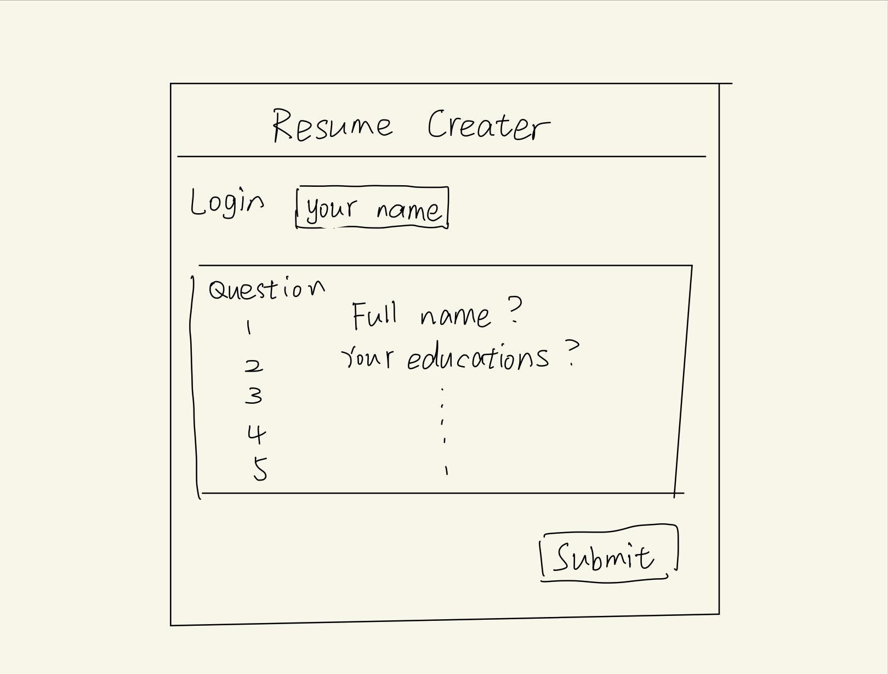

# Resume creater

## Elevator pitch

Have you ever found it is so hard to create a good resume? The Resume creater application is all you will need! You could log in to your own account in this website and save all your work! You just need to fill out a few question about yourself and then the website will just created a resume for you!

## Design

## Key features

- User could create an account and log in to the website
- User could save their work and resume
- User could edit their resume
- User could download their resume
- Results are persisently stored

## Technologies

- **HTML** - Use the correct TML structre for this application.
- **CSS** - Use CSS to make the website looks better.
- **JavaScript** - Use JavaScript to make the website more interactive.
- **Service** - Backend service with endpoints for:
  - login
  - retrieving choices
  - submitting questions
- **DB** - Store users, their answers, in database.
- **Login** - Register and login users. Credentials securely stored in database. Can't answer the question unless authenticated.
- **WebSocket** - Both the client and the server can send and receive data at the same time.
- **React** - Application ported to use the React web framework.

## HTML deliverable

For this deliverable I built out the structure of my application using HTML.

- **HTML pages** - Two HTML page that represent the ability to login and submit the answers.
- **Links** - The login page automatically links to the question page. The question page contains links for every questions.
- **Text** - Each of the questions is represented by a textual description.
- **Images** - No image yet. 😔
- **Login** - Input box and submit button for login.
- **Database** - The answer represent data pulled from the database.
- **WebSocket** - The answers represent the tally of realtime.

## CSS deliverable

For this deliverable I properly styled the application into its final appearance.

- **Header, footer, and main content body**
- **Navigation elements** - I dropped the underlines and changed the color for anchor elements.
- **Responsive to window resizing** - My app looks great on all window sizes and devices
- **Application elements** - Used good contrast and whitespace
- **Application text content** - Consistent fonts
- **Application images** - Still don't have images and so no styling here. 😔

## JavaScript deliverable

For this deliverable I implemented by JavaScript so that the application works for a single user. I also added placeholders for future technology.

- **login** - When you press enter or the login button it takes you to the create page.
- **database** - Click the submit button and the data will be stored. Currently this is stored and retrieved from local storage, but it will be replaced with the database data later.
- **WebSocket** - This will be implement with WebSocket later.
- **application logic** - Every time you refresh the About page, there will be a new quote displayed.

## Service deliverable

For this deliverable I added backend endpoints that receives votes and returns the voting totals.

- **Node.js/Express HTTP service** - done!
- **Static middleware for frontend** - done!
- **Calls to third party endpoints** - Every time you refresh the About page, there will be a new quote displayed.
- **Backend service endpoints** - Placeholders for login that stores the current user on the server.
- **Frontend calls service endpoints** - I did this using the fetch function in the About page.

## DB deliverable

For this deliverable I stored the votes in the database.

- **MongoDB Atlas database created** - done!
- **Endpoints for data** - My stubbed out endpoints now process the data and send it to Mongo.
- **Stores data in MongoDB** - done!

## Login deliverable

For this deliverable I associate the votes with the logged in user.

- **User registration** - Creates a new account in the database.
- **existing user** - Stores the votes under the same user if the user already exists.
- **Use MongoDB to store credentials** - Stores both user and their votes.
- **Restricts functionality** - You cannot vote until you have logged in. This is restricted on the frontend only. 😔

## WebSocket deliverable

For this deliverable I used webSocket to update the votes on the frontend in realtime.

- **Backend listens for WebSocket connection** - done!
- **Frontend makes WebSocket connection** - done!
- **Data sent over WebSocket connection** - done!
- **WebSocket data displayed** - Users can chat in realtime. 😔

## React deliverable

For this deliverable I converted the application over to use Vue. I know it is supposed to use React, but the instructor said I could use Vue because I already have extensive experience with React.

- **Bundled and transpiled** - done!
- **Components** - Login, voting list, vote are all components.
- **Router** - Routing between login and voting components.
- **Hooks** - Vue uses class properties instead of `UseState` to track changes in vote state.
